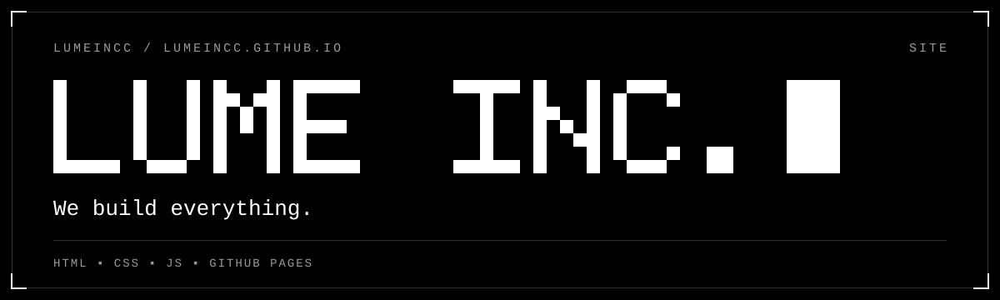

The LUME INC. site.

**[→ bogdank-dev.github.io](https://bogdank-dev.github.io/)**

Static. No build step. GitHub Pages serves `main` as is.

| File | What it is |
|---|---|
| `index.html` | The page. Copy lives here |
| `style.css` | White page, soft type, crop-mark frames |
| `site.js` | Draws the pixel type and the dot-matrix numbers from one 5x7 font |
| `favicon.svg`, `og.png` | Tab icon and link preview |

Pixel text is any element with `data-px="TEXT"`. Add `data-mode="dot"` for round dots, `data-cursor` for the blinking block, `data-cell` for size.
