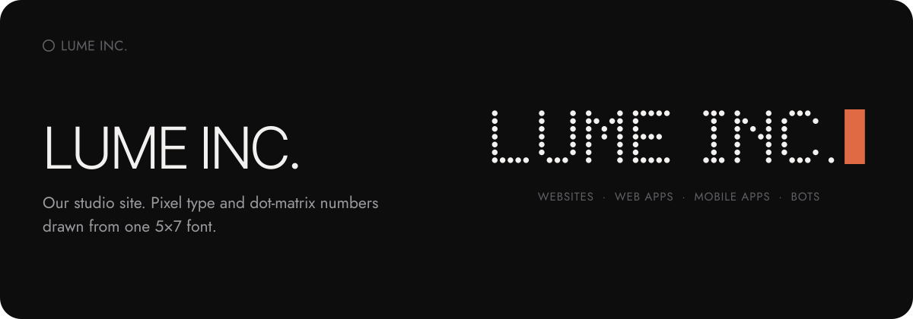

The LUME INC. site.

**[→ lumeincc.github.io](https://lumeincc.github.io/)** · **[RU](https://lumeincc.github.io/ru/)**

Static. No build step. GitHub Pages serves `main` as is.

| File | What it is |
|---|---|
| `index.html` | English page. Copy lives here |
| `ru/index.html` | Russian page. Same markup, same assets. Edit both when the copy changes |
| `style.css` | Dark page, Inter Tight for type and Jost for interface text, one warm accent |
| `site.js` | The typing word in the hero, the services switcher, dot-matrix numbers and the products loader |
| `fonts/` | Inter Tight and Jost, self-hosted (Latin and Cyrillic, SIL OFL 1.1). No Google Fonts request |
| `favicon.svg`, `og.png`, `og-ru.png` | Tab icon and link previews (EN and RU) |

The hero word is any `.cycle` element with `data-words="A|B|C"`. It erases back to what the next word shares and types the rest. With reduced motion the first word stays.

Dot-matrix numbers are any `.dm` element with `data-dm="07:30"`; `data-pitch` sets the dot spacing.
